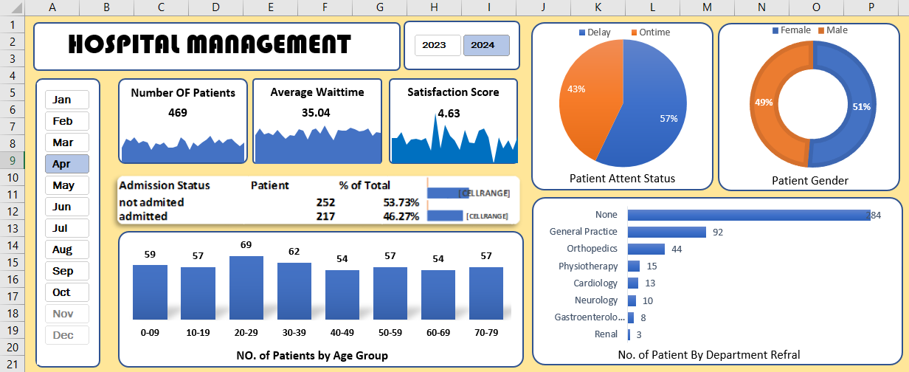

# 🏥 Excel-Dashboard-Project

This project demonstrates an end-to-end Excel solution for managing and analyzing hospital data. It covers data cleaning, transformation, and visualization using Excel tools like pivot tables, charts, and slicers.

---

## 📈 Dashboard Highlights

This Excel dashboard is fully interactive and updates automatically based on the *month selected* using the slicer on the left-hand side.

Key metrics shown dynamically:
- *Total Number of Patients*
- *Average Wait Time*
- *Satisfaction Score*
- *Patient Gender Distribution*
- *Patient Attent Status (On Time vs Delay)*
- *Admission Status (Admitted vs Not Admitted)*
- *No. of Patients by Age Group*
- *Department-wise Patient Referrals*

---

## 📁 Project Files

- Raw Data.xlsx  
  → Original uncleaned hospital dataset.

- Cleaned Data and Dashbord.xlsx  
  → Cleaned data on Sheet1, dashboard created on Sheet2.

- dashboard-screenshot.png  
  → Screenshot of the final interactive Excel dashboard.

---

## 💡 Tools & Skills Used

- *Microsoft Excel*
  - Data Cleaning
  - Pivot Tables
  - Charts (Pie, Bar)
  - Interactive Dashboard Design
- *Excel Formulas & Functions*
- (Optional future skill) Power Query

---

## 📷 Dashboard Preview

---

## 🚀 How to Use

1. Open Cleaned Data and Dashbord.xlsx.
2. Go to *Sheet2* to view the interactive dashboard.
3. Use the month slicer on the left to explore data for each month.

---

## 🧠 Learnings from the Project

- Clean and organize real-world healthcare data in Excel.
- Create dashboards that respond to user selections.
- Use pivot tables and charts to generate dynamic insights.

---

## 📬 Contact

If you have any feedback or suggestions, feel free to connect or open an issue on this repository.
